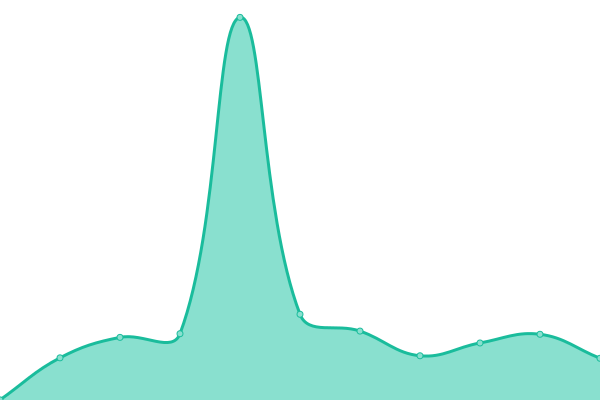

# [📈 Live Status](https://uptime.samppiiiii.com): <!--live status--> **🟩 All systems operational**

This repository contains the open-source uptime monitor and status page for [Sam Piper](www.sampiiiii.dev), powered by [Upptime](https://github.com/upptime/upptime).

With [Upptime](https://upptime.js.org), you can get your own unlimited and free uptime monitor and status page, powered entirely by a GitHub repository. We use [Issues](https://github.com/Sampiiiii/services-uptime/issues) as incident reports, [Actions](https://github.com/Sampiiiii/services-uptime/actions) as uptime monitors, and [Pages](https://uptime.samppiiiii.com) for the status page.

<!--start: status pages-->
<!-- This summary is generated by Upptime (https://github.com/upptime/upptime) -->
<!-- Do not edit this manually, your changes will be overwritten -->
<!-- prettier-ignore -->
| URL | Status | History | Response Time | Uptime |
| --- | ------ | ------- | ------------- | ------ |
|  [Sampiiiii.dev](https://sampiiiii.dev) | 🟩 Up | [sampiiiii-dev.yml](https://github.com/Sampiiiii/services-uptime/commits/HEAD/history/sampiiiii-dev.yml) | 

 510ms
     
 | 

<a href="https://uptime.sampiiiii.com/history/sampiiiii-dev">99.71%</a>
    

|  [Gitlab](https://gitlab.sampiiiii.com) | 🟩 Up | [gitlab.yml](https://github.com/Sampiiiii/services-uptime/commits/HEAD/history/gitlab.yml) | 

 1059ms
     
 | 

<a href="https://uptime.sampiiiii.com/history/gitlab">99.71%</a>
    

|  [Nextcloud](https://nextcloud.sampiiiii.com) | 🟩 Up | [nextcloud.yml](https://github.com/Sampiiiii/services-uptime/commits/HEAD/history/nextcloud.yml) | 

 2714ms
     
 | 

<a href="https://uptime.sampiiiii.com/history/nextcloud">99.72%</a>
    

|  [Drone](https://drone.sampiiiii.com) | 🟩 Up | [drone.yml](https://github.com/Sampiiiii/services-uptime/commits/HEAD/history/drone.yml) | 

 593ms
     
 | 

<a href="https://uptime.sampiiiii.com/history/drone">67.77%</a>
    

|  [Code Server](https://code-server.sampiiiii.com) | 🟩 Up | [code-server.yml](https://github.com/Sampiiiii/services-uptime/commits/HEAD/history/code-server.yml) | 

 607ms
     
 | 

<a href="https://uptime.sampiiiii.com/history/code-server">99.73%</a>
    

<!--end: status pages-->

[**Visit our status website →**](https://uptime.samppiiiii.com)

## 📄 License

- Powered by: [Upptime](https://github.com/upptime/upptime)
- Code: [MIT](./LICENSE) © [Sam Piper](www.sampiiiii.dev)
- Data in the `./history` directory: [Open Database License](https://opendatacommons.org/licenses/odbl/1-0/)
